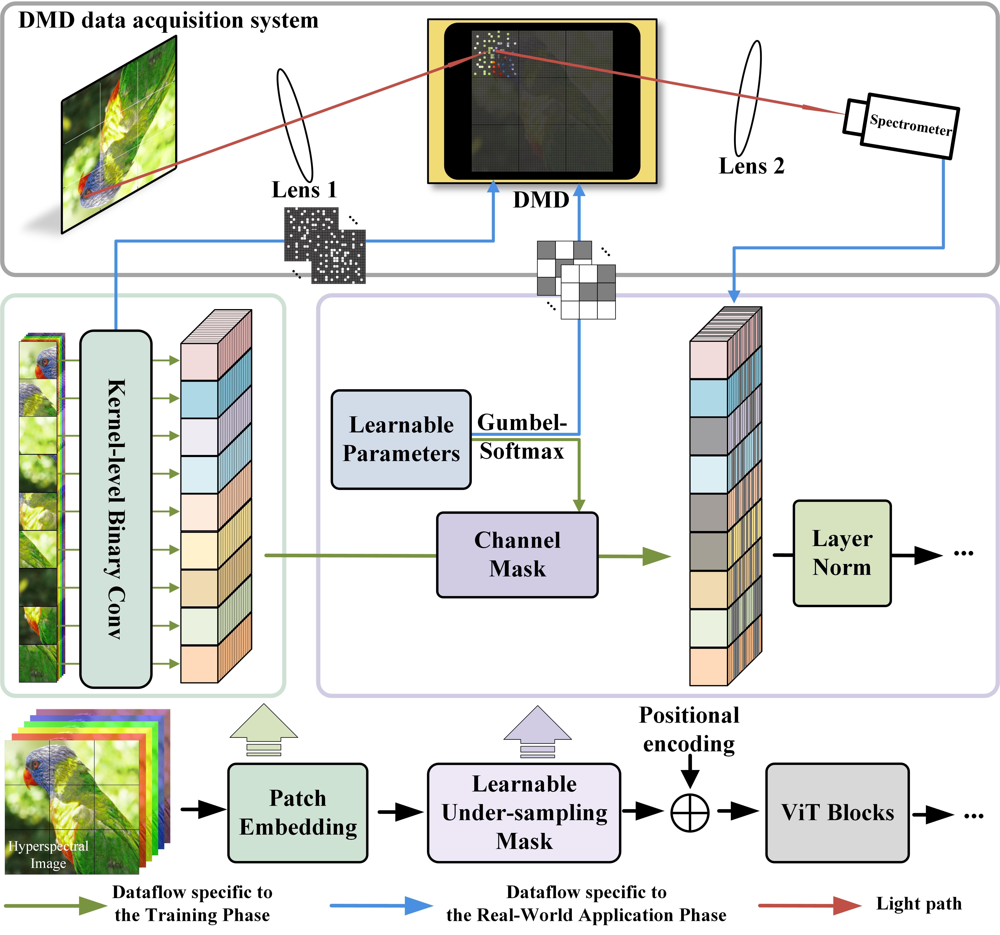

# LUM-ViT Model

**Note: This repository is currently hosting a partial set of the code. Additional content, including further code and models, will be made available soon. Stay tuned!**

This repository is dedicated to the LUM-ViT model, a novel Vision Transformer (ViT) adaptation designed for efficient hyperspectral data processing under bandwidth constraints. By leveraging pre-acquisition modulation through a learnable under-sampling mask, LUM-ViT significantly reduces the volume of data required for high-accuracy detection tasks, demonstrating remarkable efficiency on the ImageNet classification with minimal accuracy loss.

[\[OpenReview (ICLR 2024)\]](https://openreview.net/forum?id=wkbeqr5XhC)
[\[arXiv\]](https://arxiv.org/abs/2403.01412)

## Project Overview

LUM-ViT addresses the challenge of real-time hyperspectral data detection by introducing a deep learning-based modulation process prior to data acquisition. The core of this approach is the LUM-ViT model, a variant of the Vision Transformer that integrates a learnable under-sampling mask for pre-acquisition modulation. This innovative technique, coupled with kernel-level weight binarization and a three-stage fine-tuning strategy, allows for substantial data volume reduction while maintaining near-original accuracy on real-world optical hardware.

## Core Methodology



The methodology behind LUM-ViT emphasizes on pre-acquisition modulation and optical calculations optimization. Our model's architecture and fine-tuning strategies are detailed further in the repository.

## Dependencies

- PyTorch: A machine learning library for applications like computer vision and natural language processing. [Installation instructions](https://pytorch.org/)
- Timm: A deep-learning library with image models and utilities. Install via pip:

  ```sh
  pip install timm
  ```

## Installation

Before running the LUM-ViT model, ensure the following libraries are installed:

1. Install PyTorch following the instructions on its official website.
2. Install Timm using pip:

   ```sh
   pip install timm
   ```

The main implementation of the LUM-ViT model can be found in `LUM-ViT.py`, relying on the `VisionTransformer` class defined in `MAE.py` for foundational transformer architecture.

## Citation

If you find our work useful in your research, please consider citing:

```bibtex
@inproceedings{liu2024lumvit,
  title={LUM-ViT: Learnable Under-sampling Mask Vision Transformer for Bandwidth Limited Optical Signal Acquisition},
  author={Liu, Lingfeng and Ni, Dong and Yuan, Hangjie},
  booktitle={International Conference on Learning Representations},
  year={2024},
  url={https://openreview.net/forum?id=wkbeqr5XhC}
}
```

```bibtex
@misc{liu2024lumvit,
      title={LUM-ViT: Learnable Under-sampling Mask Vision Transformer for Bandwidth Limited Optical Signal Acquisition}, 
      author={Lingfeng Liu and Dong Ni and Hangjie Yuan},
      year={2024},
      eprint={2403.01412},
      archivePrefix={arXiv},
      primaryClass={cs.CV}
}
```

## Acknowledgements

This work was supported by National Natural Science Foundation of China under Grant 62173298.

We invite the community to engage with our work, contribute to the project, and help us refine our approach to hyperspectral data processing.
